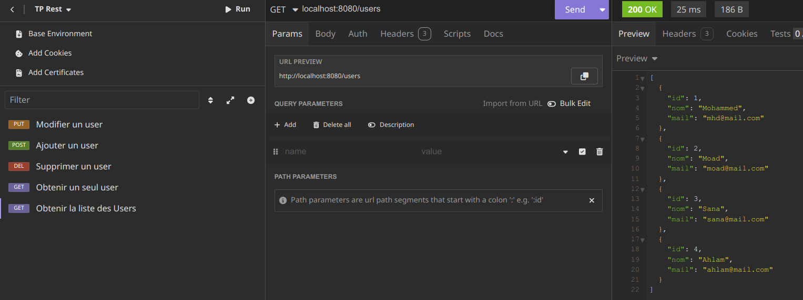
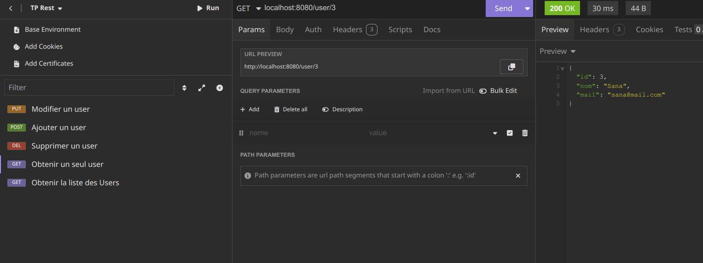
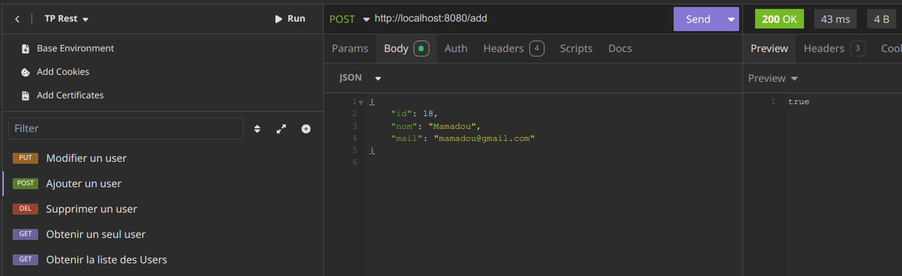
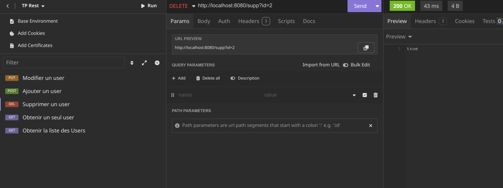
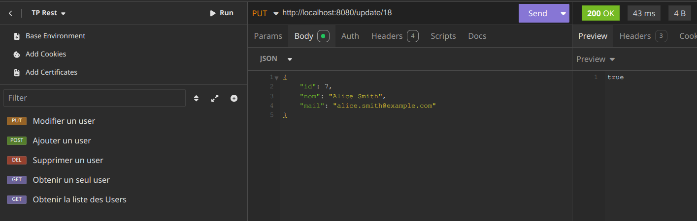
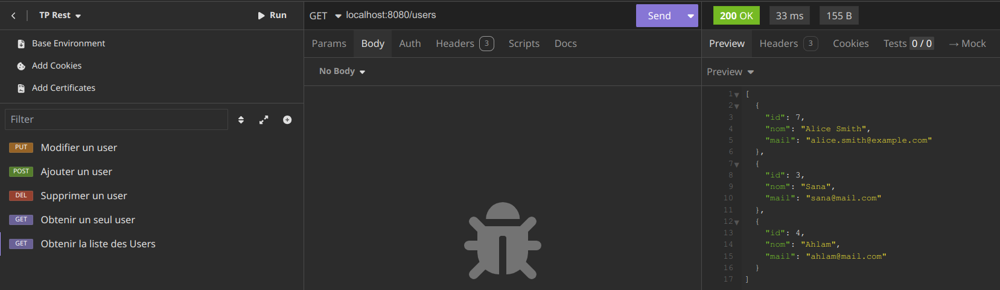

# TP sur les Contrôleurs REST (2 Novembre 2024)

Ce TP a pour objectif de se familiariser avec les contrôleurs REST en utilisant un framework de votre choix (ici Spring Boot pour Java.).

## Fonctionnalités Implémentées

### 1. Obtenir tous les utilisateurs

Cette fonctionnalité permet de récupérer la liste de tous les utilisateurs enregistrés dans liste chargée en mémoire.

### 2. Obtenir un utilisateur

Cette fonctionnalité permet de récupérer les informations d'un utilisateur spécifique en utilisant son identifiant unique.

### 3. Ajouter un utilisateur

Cette fonctionnalité permet d'ajouter un nouvel utilisateur à liste chargée en mémoire.

### 4. Supprimer un utilisateur

Cette fonctionnalité permet de supprimer un utilisateur de liste chargée en mémoire en utilisant son identifiant unique.

### 5. Mettre à jour un utilisateur

Cette fonctionnalité permet de mettre à jour les informations d'un utilisateur existant dans liste chargée en mémoire.

### 6. Obtenir tous les utilisateurs à la fin

Cette fonctionnalité permet de récupérer la liste de tous les utilisateurs enregistrés dans liste chargée en mémoire après avoir effectué diverses opérations (ajout, suppression, mise à jour).

## Structure du Projet

- `assets/` : Contient les captures d'écran des différentes fonctionnalités.
- `src/` : Contient le code source du projet.
- `README.md` : Ce fichier.